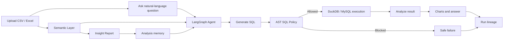

# Nexa

Nexa is a trustworthy AI data analysis workspace. It lets users upload tabular data, ask questions in natural language, and receive SQL-backed analysis, charts, and reproducible evidence for each answer.

The project is intentionally scoped around one hard problem:

> Can an AI data agent produce answers that are safe to execute, traceable, and measurable?

## What Makes It Resume-Worthy

- AST-based SQL safety layer that only allows read-only single-statement queries, blocks DDL/DML operations, applies row limits, and records policy decisions.
- Run-level lineage that preserves the question, schema snapshot, SQL attempts, policy decisions, result samples, retries, errors, and final answer.
- Semantic Layer for governed metrics and dimensions, so the agent can reason with business definitions instead of raw column guesses.
- Insight Report generation that turns a dataset into a SQL-backed, Markdown-ready analysis report with highlights and evidence blocks.
- Analysis memory that injects recent questions and report findings into follow-up analysis, supporting longer-running analysis threads.
- LangGraph agent pipeline with SQL retry separated from system retry, reducing repeated full-pipeline retries and making failures auditable.
- Production-oriented baseline: pytest, frontend lint/build, GitHub Actions CI, Docker Compose, Alembic migrations, route-level code splitting.

## Current Verification Snapshot

These commands were last run locally:

```text
backend pytest: 72 passed
frontend lint: passed
frontend build: passed
```

Offline evaluation on the bundled Superstore suite:

```text
case_count: 12
sql_policy_pass_rate: 1.0
execution_success_rate: 1.0
semantic_accuracy: 1.0
avg_latency_ms: ~3-4
```

The evaluation harness currently uses golden SQL as a deterministic baseline. The next step is to compare real Agent-generated SQL against the same cases.

## Core Workflow



## Trust Architecture

| Layer | Responsibility | Implementation |
|---|---|---|
| SQL safety | Prevent unsafe model-generated queries from reaching execution | `sqlglot` AST inspection in `backend/services/sql_policy.py` |
| Query guardrails | Bound query cost and runaway execution | automatic `LIMIT 10000`, DuckDB interrupt-based timeout, MySQL session timeout attempt |
| Lineage | Make every answer reproducible and auditable | `Run.lineage` JSON and Run History evidence panel |
| Retry control | Avoid duplicating full Agent runs for normal SQL mistakes | graph-level `sql_retry`; controller-level `system_retries` only for thrown system errors |
| Evaluation | Measure changes instead of trusting demos | `backend/evaluation/runner.py` and golden Superstore cases |
| Semantic layer | Stabilize business metric definitions | Metric and dimension APIs in `backend/api/semantic.py` |
| Report generation | Convert analysis runs into reusable deliverables | SQL-backed reports in `backend/services/analysis_reports.py` |
| Analysis memory | Preserve context across follow-up questions and reports | Conversation/report memory injected into chat context |

## Main Features

| Feature | Status | Notes |
|---|---:|---|
| Natural language data analysis | Working | LangGraph pipeline: understand, plan, SQL, execute, analyze, visualize, compose |
| CSV / Excel upload | Working | Preview before upload and DuckDB-backed querying |
| Multi-dataset schema context | Working | Chat can receive multiple selected datasets |
| SQL safety policy | Working | AST-based read-only validation, single-statement enforcement, auto-limit, risk flags |
| Run History | Working | Step timeline plus lineage evidence chain |
| Semantic Layer | Working | Auto-seeds metrics/dimensions from schema and supports custom business definitions |
| Insight Reports | Working | Generates Markdown reports with SQL evidence blocks and highlights |
| Analysis Memory | Working | Uses recent messages and reports as follow-up context |
| Offline evaluation | Working | 12 Superstore cases, expandable to 30-50 |
| Workflow engine | Working MVP | Save/edit/rerun analysis pipelines; still intentionally simple |
| Skill system | Working MVP | Built-in manifest-based skills |
| Frontend performance | Improved | Route/tab lazy loading and vendor chunk splitting |
| CI | Working | GitHub Actions runs backend tests, frontend lint, frontend build |

## Tech Stack

| Layer | Technology |
|---|---|
| Frontend | React 19, TypeScript, Vite |
| UI | Ant Design, AG Grid |
| Charts | Apache ECharts |
| Backend | FastAPI, SQLAlchemy |
| Agent | LangGraph |
| SQL policy | sqlglot |
| Data engine | DuckDB, Pandas, MySQL connector |
| Persistence | SQLite for local development, PostgreSQL-compatible config, Alembic |
| Auth | JWT, bcrypt |
| Streaming | Server-Sent Events |
| CI | GitHub Actions |

## Quick Start

### Backend

```powershell
cd backend
python -m venv venv
.\venv\Scripts\activate
pip install -r requirements.txt
python main.py
```

Backend API: `http://localhost:8000`

### Frontend

```powershell
cd frontend
npm install
npm run dev
```

Frontend: `http://localhost:5173`

### Docker

```powershell
docker compose up --build
```

## Validation Commands

Run these from the repository root:

```powershell
.\backend\venv\Scripts\python.exe -m pytest backend/tests -q
npm run lint --prefix frontend
npm run build --prefix frontend
```

Run offline evaluation:

```powershell
Push-Location backend
.\venv\Scripts\python.exe -m evaluation.runner --format markdown
Pop-Location
```

## Project Structure

```text
Nexa/
  backend/
    agents/          LangGraph pipeline, nodes, controller, tools
    api/             FastAPI routes
    evaluation/      Offline evaluation suites and runner
    models/          SQLAlchemy models
    services/        Auth, run tracking, SQL policy, semantic/report services
    tests/           Backend regression tests
    tools/           DuckDB/MySQL query engines
  frontend/
    src/pages/       App pages including Run History evidence view
    src/components/  Shared UI components
    src/services/    API service layer
    src/types/       Shared TypeScript types
  .github/workflows/ CI pipeline
  docker-compose.yml
```

## Demo Path

1. Start backend and frontend.
2. Create a project.
3. Upload `backend/storage/Sample - Superstore.csv`.
4. Open Semantic Layer and review the auto-seeded metrics/dimensions.
5. Open Reports and generate an Insight Report.
6. Ask: `What is total sales by region?`
7. Open Run History and expand the latest run.
8. Show the evidence chain: schema hash, SQL attempts, policy decision, final SQL, sample rows, answer summary.
9. Run the offline evaluation harness to show objective metrics.

## Resume Bullets

- Built a trustworthy AI data analysis agent with LangGraph, FastAPI, DuckDB, and React, enabling natural-language analysis over uploaded datasets with SQL-backed answers and visualizations.
- Designed an AST-based SQL safety layer using `sqlglot`, enforcing read-only single-statement queries, blocking DDL/DML operations, applying row limits, and recording policy decisions for auditability.
- Implemented run-level lineage tracking that captures question, schema snapshot, generated SQL, policy decisions, retries, result samples, and final answer for reproducible analysis.
- Added a governed Semantic Layer and Insight Report generator, turning uploaded datasets into reusable business metrics, dimensions, Markdown reports, and SQL-backed evidence blocks.
- Created an offline evaluation harness with golden SQL cases measuring policy pass rate, execution success, semantic accuracy, and latency, turning prompt/model changes into measurable regressions.
- Hardened engineering baseline with 69 backend tests, frontend lint/build checks, GitHub Actions CI, route-level code splitting, and Alembic migration support.

## Honest Boundaries

Nexa is still a portfolio-grade project, not an enterprise BI platform.

- The evaluation suite has 12 deterministic golden cases and should be expanded to 30-50 cases.
- Token usage is still estimated, not provider-reported.
- Workflow execution is an MVP and does not yet support branching, scheduling, or durable resumability.
- Python notebook execution still needs sandboxing before being treated as production-safe.
- The SQL policy records high-risk patterns like `SELECT *` and joins without conditions, but only blocks clearly unsafe operations today.

## Next Roadmap

| Priority | Work | Why |
|---|---|---|
| P0 | Expand evaluation to 30-50 real Agent cases | Measure actual model quality, not only golden SQL execution |
| P0 | Record provider token usage and latency | Make cost/performance claims real |
| P1 | Add SQL dry-run / EXPLAIN checks | Catch expensive or invalid queries before execution |
| P1 | Add demo seed command and hosted demo | Make the project easier to review |
| P2 | Sandbox notebook Python | Close the largest remaining security gap |

## License

MIT
